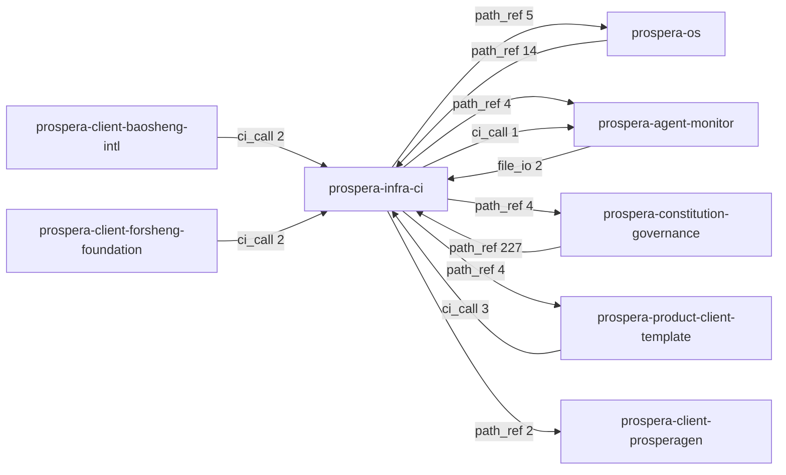
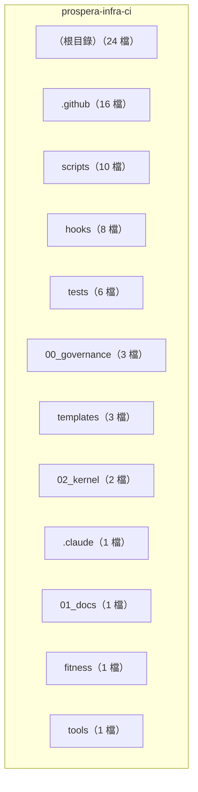

<!-- Prospera SYSTEM HEADER (ADR-0032/SBOM) | 性質:doc(架構文件 arc42＋C4) | 設計:Kevin 架構(發明人) | 執行:AI 工具(Claude Code) | 驗證:依 origin/main 222a326 事實產生 | IP:創造性歸 Kevin(發明人), AI 為執行工具 -->
# prospera-infra-ci 架構（arc42 精簡版＋C4）

> 依據：`222a326`（2026-09-26）之版控內容；DNA v2 D4 architecture_doc_present（GOVERNANCE_PLAN 波 5）。內容隨結構變更之申請單一併更新。

## 1. 引言與目標

定位（摘自 CLAUDE.md）：

- **Ring**:    Ring 6
- **Tier**:    L6 — Infrastructure
- **Input**:   Every commit/PR from all repos
- **Output**:  CI pass/fail + SKILL enforcement
- **Owner**:   SKILL-CORE v3.4 + 4 workflows

## 2. 限制

- 語言：回報、提交訊息、申請單與檔案內文一律繁體中文（CLAUDE.md 語言規則）。
- 治理正本：prospera-constitution-governance `00_governance/GOVERNANCE_FINAL.md`；現況一律以 git 為準。

## 3. 系統範圍與脈絡（C4 第 1 層）

相依（治理庫 `ecosystem_consolidation/dependency.csv`，取次數最多者各 6）：

## 5. 建構區塊（C4 第 2 層）

頂層目錄與版控檔數：

## 9. 架構決策

- `00_governance/ADR/ADR-0001-central-ci-governance-producer.md`
- `01_docs/architecture/ADR-000-INDEX.md`

## 10. 品質要求與 KPI（實測）

| KPI | 目標 | 實測 |
|---|---|---|
| 版控檔數 | — | 76 |
| .py 前 6 行 IP 標頭覆蓋 | 100% | 28/28 |
| 測試收集 | 可收集 | 117 tests collected in 0.03s |
| SYSTEM_INVENTORY 隨 HEAD 更新 | 是 | 見 SYSTEM_INVENTORY.json ground_truth_check.complete_at_head |

## 11. 風險與技術債

- 逐項風險見治理庫 `00_governance/ecosystem_consolidation/ANALYSIS.md` 本庫列；計畫差距見 `repo_governance/plan_gap.json`。
